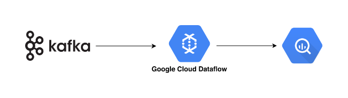

# Kafa-DataFlow-BigQuery Streaming
- [Kafa-DataFlow-BigQuery Streaming](#kafa-dataflow-bigquery-streaming)
  - [Kafka Setup on GCP vm](#kafka-setup-on-gcp-vm)
    - [Remove Conflicting packages](#remove-conflicting-packages)
    - [Add Docker's official GPG key](#add-dockers-official-gpg-key)
    - [Add the repository to Apt sources](#add-the-repository-to-apt-sources)
    - [Run update](#run-update)
    - [Install Docker](#install-docker)
    - [Start the Kafka cluster](#start-the-kafka-cluster)
  - [Setup gcloud sdk on local](#setup-gcloud-sdk-on-local)
    - [Initialise](#initialise)
    - [List available projects](#list-available-projects)
    - [Set active project](#set-active-project)
    - [Authentication to create defualt credentials file](#authentication-to-create-defualt-credentials-file)
  - [Run Dataflow job](#run-dataflow-job)



This project is about setting up kafka cluster on GCP vm, sending data to kafka cluster and write it to Big query using Google Dataflow

## Kafka Setup on GCP vm

Steps to build and run the kafka docker container on GCP vm using docker compose file 

### Remove Conflicting packages

```
for pkg in docker.io docker-doc docker-compose podman-docker containerd runc; do sudo apt-get remove $pkg; done
```

### Add Docker's official GPG key

```
sudo apt-get update
sudo apt-get install ca-certificates curl gnupg
sudo install -m 0755 -d /etc/apt/keyrings
curl -fsSL https://download.docker.com/linux/ubuntu/gpg | sudo gpg --dearmor -o /etc/apt/keyrings/docker.gpg
sudo chmod a+r /etc/apt/keyrings/docker.gpg
```

### Add the repository to Apt sources

```
echo \
  "deb [arch="$(dpkg --print-architecture)" signed-by=/etc/apt/keyrings/docker.gpg] https://download.docker.com/linux/ubuntu \
  "$(. /etc/os-release && echo "$VERSION_CODENAME")" stable" | \
  sudo tee /etc/apt/sources.list.d/docker.list > /dev/null
```

### Run update

```
sudo apt-get update
```

### Install Docker

```
sudo apt-get install docker-ce docker-ce-cli containerd.io docker-buildx-plugin docker-compose-plugin
```

### Start the Kafka cluster

```
sudo docker compose -f "docker-compose.yaml" up -d --build
```
**note: copy the docker-compose.yaml file on GCP vm before excecuting the command**


## Setup gcloud sdk on local

Setup gcloud SDK on local and complete authentication steps

### Initialise
```
gcloud init
```

### List available projects
```
gcloud projects list
```

### Set active project
```
gcloud config set project <projectid>
```

### Authentication to create defualt credentials file
```
gcloud auth application-default login
```

## Run Dataflow job

**prerequisites**

Install the required dependencies from the requirements.txt file, make sure kafka cluster is up and running 

```
python data-processor.py --bootstrap_servers VM_IP:PORT --topic <topic name> --project <gcp project id> --bq_dataset <dataset> --bq_table_name <tablename> --runner DataflowRunner --region <region> --worker_zone <zone> --staging_location gs://<bucket name>/staging --temp_location gs://<bucket name>/temp--job_name <job name> 
```


