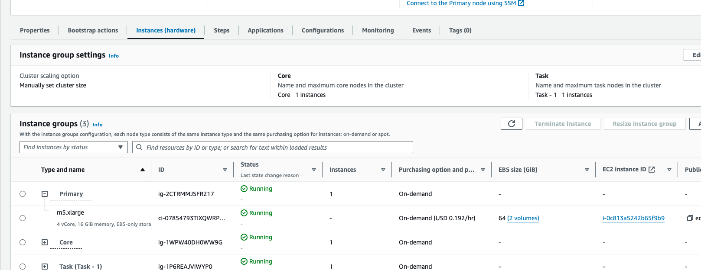

# PySpark + EMR


## About
This mini project is about running pyspark jobs on AWS EMR.


## Setup AWS resources

There are several ways to setup a Spark cluster on AWS, we will using the AWS EMR to run our PySpark Job. For this we will be creating a new VPC, S3 buckets and provison AWS EMR cluster with required roles and permissons.

### Create a VPC

In AWS search bar search for VPC, click on VPC, there will be a default vpc presen. Now click on create VPC, provide a name to your vpc select number of availability zone as 1 and select the zone in which the EMR instances will be provisioned, in this case it is us-east-1.


Now set the number of public and private zones as 1, select S3 Gateway as Gateway.
Leave the rest to default and the config should look like below.


Click on Create VPC.

Now our spark-emr vpc is up and running, next step is to create the S3 bucket to store the files.

### Create S3 bucket

From AWS search bar search for S3 and navigate to S3 then click on create bucket.
Provide a unique name to your bucket, select prefered zone, uncheck the block public access check box and acknowledge the warning, leave the rest to defaults and click on create bucket.


Once the bucket is ready, upload the files and folders containing data files and spark code.


### Create IAM role for EMR cluster

This EMR role allow EMR cluster to access S3.

From AWS search bar navigate to IAM then go to roles and click create role.
On the create role page select AWS service, in use case search for EMR and select EMR, proceed to next.


Got to the role details and we can see there's no S3 access. Click on add permissions.


Search for s3, select s3 full access, click on add permissions.


### Create EMR cluster

From AWS search bar navigate to AWS EMR and click on create cluster.
Provide a name to the cluster and make sure spark is selected from the list of softwares to be installed on the cluster.


Under Networking section from VPC dropdown select the new VPC created in the previos steps, subnet will get populated automatically, if not the manually select the subnet for that VPC.


Under security and configuration, create or select an existing KeyPair to ssh into the EMR master node.


Under Identity and IAM Management, select choose and existing role and select the IAM role created in previous steps.


Under EC2 instance profile for Amazon EMR, select create an instance profile then select "specific S3 buckets or prefixes in your account"

Click on browse and choose the s3 bucket created in previous steps.


leave the nodes configuration and others to default, click on create cluster.


## Configuring the primary node with S3 access

Once the cluster is provisioned and status displays waiting message, next step is to add s3 access permission to the role assigned to the primary node of the cluster, so the primary node can access and read code and data files from s3.

Click on the porovisioned cluster and once you're on cluster details screen scroll down to properties section. click on the "Instances" tab and expand the primary node then click on the EC2 instance ID of the primary node.



Once on the EC2 instance details page click on IAM role and click on add permissions then search and add s3fullaccess.

Now the primary the EMR cluster is all set to execute spark jobs.

### Submit Job using "Step"

One of the many ways of submitting a job to EMR cluster is by using "Step".
From the Cluster details screen go to "Steps" tab and add step, provide a name to the job then fill "command-runner.jar" as JAR location and in arguments provide the spark-submit command, leave the rest to default and add step.

```bash
spark-submit s3://spark-emr-files/code/process.py s3://spark-emr-files/data/ s3://spark-emr-files/output s3://spark-emr-files/static_data/
```


Your Spark Job will start exucuting and output files will be produced in the output s3 location.